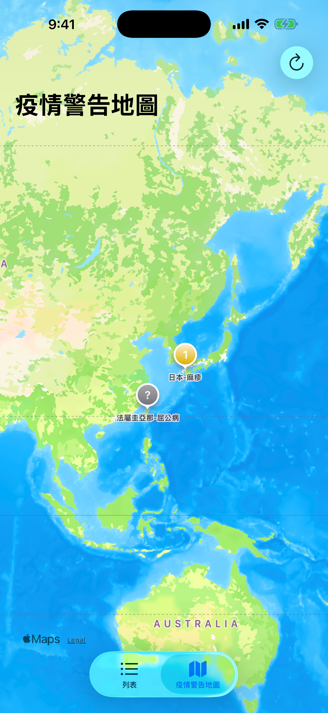
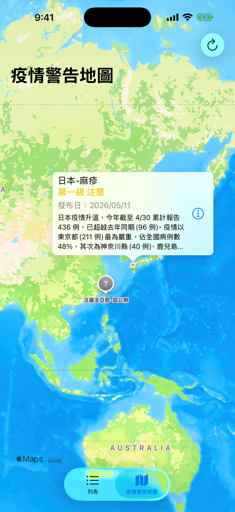

# CovidAPI

iOS app 練習作品，串接行政院疾管署（CDC）旅遊疫情建議 Open Data JSON，將世界各地疫情警告條列展示，並以地圖視覺化標註各地危險等級。

## 功能

### 列表頁
- 從 CDC `TravelEpidemic/ExportJSON` 解析疫情資料，依時序條列展示
- 下拉重新整理（pull-to-refresh），即時更新資料
- 點擊條目進入詳細頁
- 採 Dynamic Type，字體會跟著系統設定縮放

<p align="center">
  
</p>

### 詳細頁
- 顯示完整疫情描述，內容過長可捲動
- 標題置於 navigation bar，內文上方標註發布日

<p align="center">
  
</p>

### 地圖頁
- 依等級（第一 / 二 / 三級）以不同顏色標註 marker
  - 🟡 第一級 注意
  - 🟠 第二級 警示
  - 🔴 第三級 警告
  - ⚪ 未分類
- 啟動時請求 When-In-Use 位置權限，自動將地圖聚焦使用者周遭區域
- 點擊 marker 顯示自訂 callout：等級（分色）、發布日期、描述前段
- callout 右側 ⓘ 可進入詳細頁

<p align="center">
  
  
</p>

## 技術

- **語言 / UI**：Swift 5、UIKit、Storyboard
- **資料**：`URLSession` + `Codable` 解析 JSON、Repository 共用資料來源
- **離線支援**：JSON 磁碟快取，網路失敗時顯示最後一次成功資料
- **狀態管理**：Loading / Loaded / Empty / Error + Retry
- **列表**：`UITableView` + automatic row height + Dynamic Type
- **地圖**：`MapKit`（`MKMapView` / `MKMarkerAnnotationView` / 自訂 `detailCalloutAccessoryView`）
- **定位 / 地理編碼**：`CoreLocation`（`CLLocationManager`）+ `CLGeocoder`
- **架構**：`SceneDelegate` 程式建構 `UITabBarController`，列表與地圖兩個 navigation stack
- **品質**：XCTest 單元測試、GitHub Actions 持續整合

## 架構

```text
ViewController
      ↓
List ViewModel
      ↓
EpidemicRepository
   ├── CDC API Client
   └── Disk Cache
```

列表與地圖共用 `EpidemicRepository`。Repository 會合併同時發出的更新請求，成功後寫入快取；網路失敗時則回傳最後一次成功資料，避免在離線或面試展示環境中出現空白畫面。

## 搜尋與篩選

- 可搜尋國家、地區、疾病名稱與描述
- 可依第一、二、三級旅遊疫情建議篩選
- 顯示資料來源及最後更新時間

## 測試

在 Xcode 選擇 `CovidAPI` scheme 後按 `⌘U`，或執行：

```sh
xcodebuild test \
  -project CovidAPI/CovidAPI.xcodeproj \
  -scheme CovidAPI \
  -destination 'platform=iOS Simulator,name=iPhone 16'
```

目前涵蓋疫情等級判定、API 成功快取、離線 fallback，以及 ViewModel 搜尋／篩選。

## Roadmap

- [x] API / Repository / ViewModel 分層
- [x] Loading、Empty、Error 與 Retry
- [x] 離線快取與最後更新時間
- [x] 搜尋與警示等級篩選
- [x] 單元測試與 CI
- [x] 國家名稱正規化與座標快取
- [ ] 地圖 marker clustering
- [ ] 收藏地區與警示通知
- [ ] UI tests 與 VoiceOver accessibility audit

## 資料來源

- 衛福部疾管署 旅遊疫情建議：<https://www.cdc.gov.tw/TravelEpidemic/ExportJSON>

## 開發環境

- Xcode 12.5+
- iOS 14.5+
- Swift 5

### 實機簽章

Simulator 與 CI 不需要設定 Apple Developer Team。若要在實機執行：

1. 複製 `CovidAPI/Config/Signing.local.xcconfig.example` 為 `Signing.local.xcconfig`
2. 將 `YOUR_TEAM_ID` 改成自己的 Apple Developer Team ID

本機簽章檔已加入 `.gitignore`，不會把個人 Team ID 提交到公開 repository。
